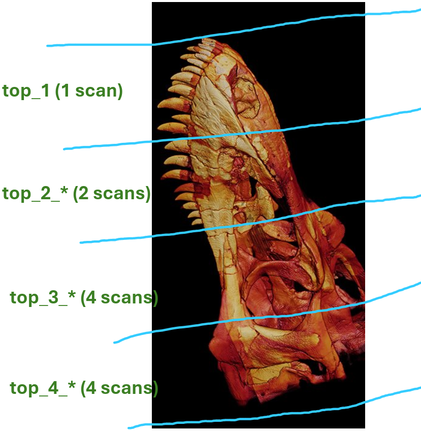

# Repository Overview

This repository implements an end-to-end CT reconstruction and 3D volume stitching pipeline. The pipeline performs:
1. FDK reconstruction using padded projections to reduce ROI artifacts (appearing as circular structures and cupping)
2. 3D volumetric stitching of the reconstructions using registration

The codebase contains a combination of reusable and dataset-specific modules and scripts.

# Dataset Description

The dataset consists of the skull of a junior T-rex named *Casper*, scanned using a Nikon micro-CT scanner at DTU's 3D Imaging Center.

The specimen exceeded the scanner's field of view and therefore required multiple overlapping scans.

The object scanned is the skull of a trex called Casper. It was done with a Nikon micro-CT scanner at DTU's 3D Imaging Center. Since the skull was much larger than the scanner was capable of capturing, it had to be done over many scans. Here specifically, 11 scans in total are considered (excluding the lower jaw). These were done in layers (see also the figure below)

```
layer 1:
    1

layer 2:
    1 0

layer 3:
    2 3
    1 0

layer 4:
    2 3
    1 0
```

<figure>
    
    <figcaption>
        Sketch of the scan layout. Note that the actual scans/layers have varying degrees of overlap unlike the figure suggests.
    </figcaption>
</figure>

Additional context:
- [DTU 3D scans dinosaur skull](https://3dim-industry-portal.dtu.dk/news/nyhed?id=ffd517c9-e78f-407b-ae7d-88c31bc2da69)
- [The technique behind 3D scanning of dinosaur skulls](https://3dim-industry-portal.dtu.dk/news/nyhed?id=be269689-1858-4df8-b7fe-66716b549097)
- [VIDEO: Da dinosaur-kraniet Casper besøgte DTU](https://3dim-industry-portal.dtu.dk/news/nyhed?id=3dcfb238-0d40-4b02-be6a-ef4619cdbfac)

# Registration Challenge

The individual reconstructions are not aligned by pure translation, as the specimen had to be moved around.

Inter-scan misalignment includes:
- 3D rotations
- Axis flips
- Small isotropic scaling differences

Therefore, stitching requires the use of rigid and similarity transforms.

The registration uses a mutual information metric to optimize the alignment.

Masking was used on some of the volumes to guide the optimizer to only look at the overlapping regions. Some of the scans had little overlap, which made them more difficult to stitch.

# How to Run

## Environment Variables
Start by setting the required environment variables `SCAN_ROOT` and `OUT_ROOT`.
- `SCAN_ROOT`: directory containing raw projection data
- `OUT_ROOT`: directory where reconstructions and stitched volumes are written

Select the dataset:
```
DATASET=full_res | downsampled | raw
```

## Reconstruction

```
DATASET=<dataset> python -m scripts.reconstruct
```
`<dataset>`:
- `full_res`: does FDK padded reconstruction on full resolution.
- `downsampled`: downsampled version of `full_res`. Run `python -m scripts.downsample_recons` after having reconstructed `full_res`.
- `raw`: only does FDK reconstruction

## Stitching

Stitching is executed recursively using defined steps between pairwise volumes:
```
DATASET=<dataset> python -m scripts.stitch_pipeline <step>
```
Available steps (some steps depend on previous steps, so execute in order):
```
step_4_10
step_4_23
step_4
step_3_10
step_3_23
step_3
step_2
step_43
step_21
step_4321
```

The final output of `step_4321` consists of the fully assembled specimen.

The results can be visualized inside of `notebooks/`.

# Dependencies
Environment used:

**conda:**
- python=3.11.9
- cil=24.1.0 (installation guide at https://github.com/TomographicImaging/CIL?tab=readme-ov-file#installation-of-cil)

**pip:**
```
antspyx==0.6.2
qim3d==1.4.0
numpy==1.26.4
scipy==1.14.0
h5py==3.11.0
memory-profiler==0.61.0
```

Other minor version variations may be compatible.
