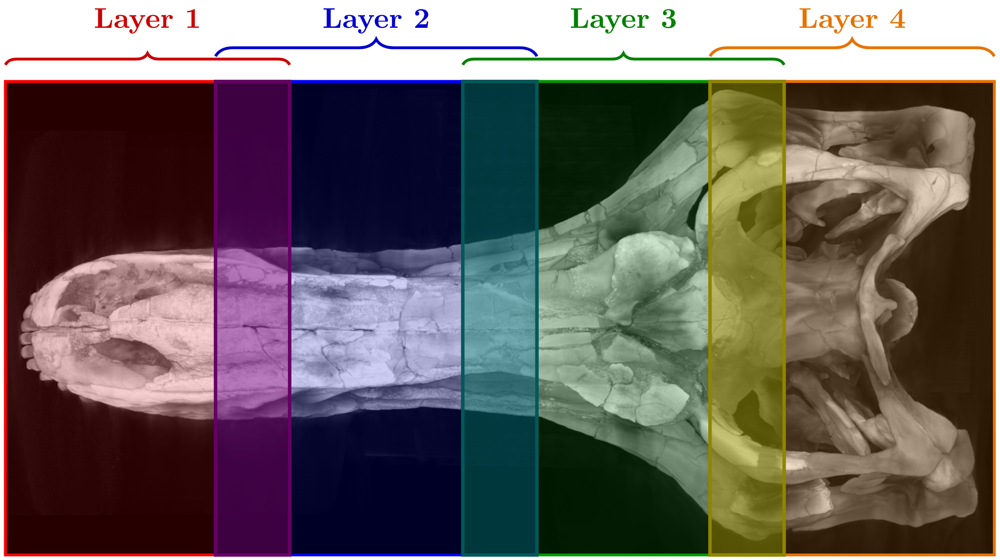
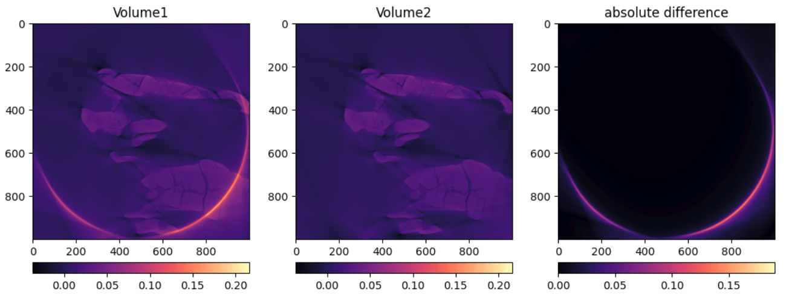
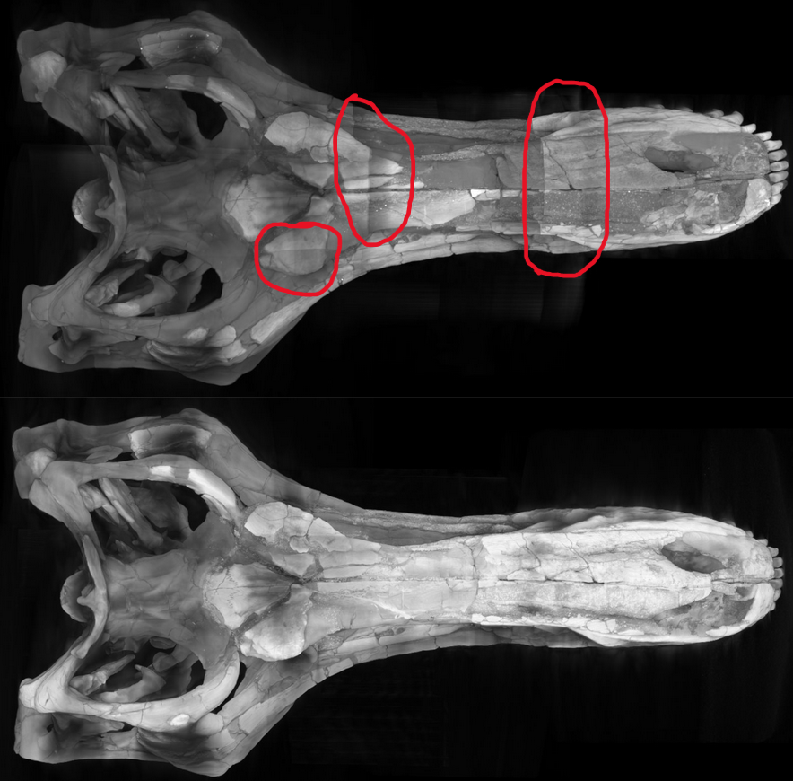
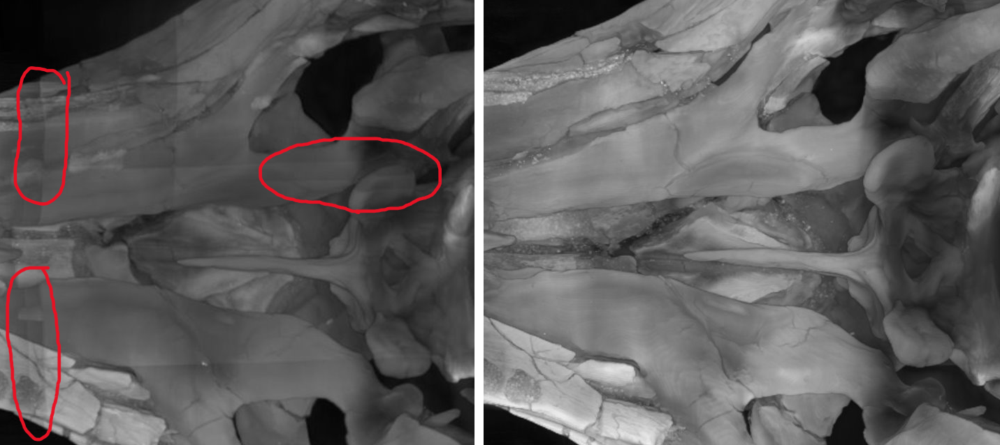
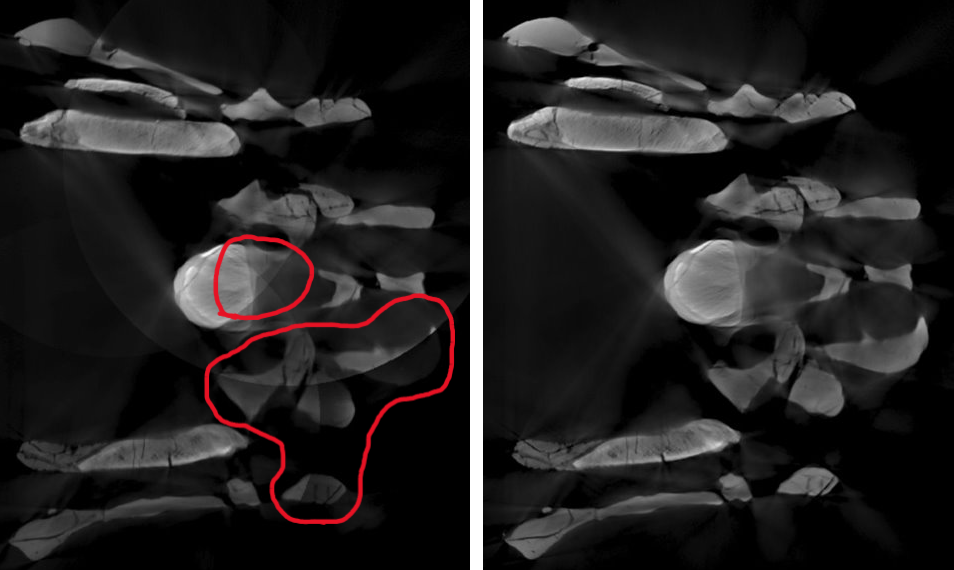
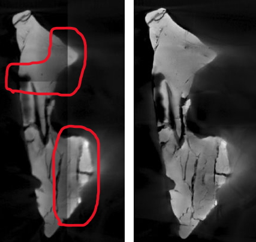
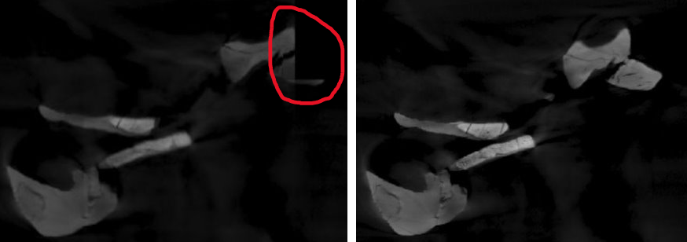
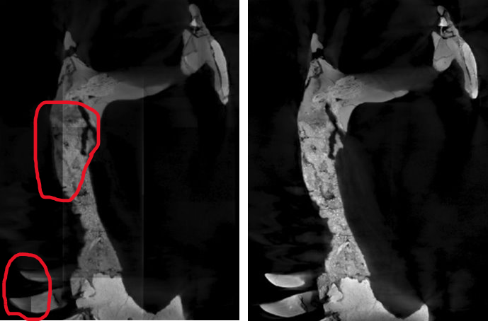

# Region-of-Interest Correction and Hierarchical Volumetric Stitching for Large-Scale Cone-Beam CT Reconstruction

**Author:** David Wang Johansen  
**Email:** s214743@dtu.dk  
**Affiliation:** <a href="https://qim.dk">QIM</a>, DTU Compute 
**Date:** April 13, 2026

<figure>
    
    <figcaption>
        <em>Final stitched reconstruction of the T-rex skull, obtained using the proposed CT padding and automatic stitching pipeline.</em>
    </figcaption>
</figure>

## Introduction

In cone-beam CT imaging, objects larger than the scanner's field of view cannot be fully reconstructed. Such an object must then be acquired through multiple sets of scans, each covering a subregion of the full volume.

This was the case for a skull of a junior T-rex called Casper. It was scanned at the DTU 3D Imaging Center with a micro-CT scanner. A total of 11 scans were acquired, distributed over 4 layers, as illustrated in the figure below.

<figure>
    
    <figcaption>
        <em>Sketch of the scan layout. The overlap is a rough approximation for visualization purposes. 11 scans are distributed over the 4 layers. Note that even though the layers are stacked horizontally here, in reality they were stacked vertically inside the CT scanner.</em>
    </figcaption>
</figure>

This acquisition setup introduces two primary challenges
- **The region of interest problem**, due to incomplete coverage of the object during acquisition.
- **Volumetric stitching**, where multiple reconstructed volumes must be aligned and combined

## The region of interest problem

In cone-beam CT reconstruction, it is assumed that the entire object remains within the field of view for all projection angles. Under this assumption, each voxel is consistently intersected by X-rays throughout the scan.

In this setup, that assumption is violated. Parts of the object extend outside the detector, and the missing regions vary with rotation angle. As a result, the measured projections are incomplete and inconsistent, as X-rays at different orientations pass through different parts of the surrounding material.

When these truncated projections are used for reconstruction, they produce characteristic artifacts:
- Cylindrical distortions centered around the rotation axis  
- Non-linear intensity gradients around these

To mitigate this, we modify the projection data prior to reconstruction by artificially extending it beyond the measured region using padding. While this does not recover the missing physical signal, it effectively shifts large parts of the resulting artifacts outside the region of interest. See the figure below.

<figure>
    
    <figcaption>
        <em>Left: without padding (raw data), Middle: with padding (augmented data), Right: difference between the two. The difference highlights the artifacts clearly. The effect is thus that we remove the circular arc artifacts towards the area where the object is excluded, and the intensity gradients that surround the arcs are also removed.</em>
    </figcaption>
</figure>

This technique is then applied on all individual scans before moving on to the next step.

### Note on proprietary reconstruction

Most CT systems provide proprietary reconstruction software with built-in corrections for common artifacts. While these methods can produce visually acceptable results, they operate as black boxes: the applied processing steps and assumptions are not exposed to the user.

This lack of transparency becomes a limitation when the reconstruction fails or when specific artifacts need to be addressed. Since only the final reconstructed volume is available, it is difficult to diagnose or correct issues post hoc.

For this reason, we instead operate directly on the raw projection data. Although this exposes all acquisition-related artifacts, it allows full control over preprocessing and reconstruction. In this case, it enables targeted mitigation of region of interest artifacts prior to reconstruction, which leads to more consistent results than the proprietary pipeline.

## The stitching problem

If the object could be captured in a single scan, reconstruction would produce one complete volume. In this case, however, the object is represented by 11 independently reconstructed volumes, each covering a subregion of the full geometry.

These volumes may partially overlap and must be aligned and merged into a single consistent reconstruction.

A manual approach involves interactively translating and rotating each volume using volumetric image editing software until overlapping regions appear aligned. This process is time-consuming and sensitive to user judgment, often requiring many small adjustments and offering limited reproducibility.

To address this, we perform automatic stitching by registering volumes in pairs. For each pair of overlapping volumes, we estimate a geometric transformation (including translation, rotation, and optional scaling) that aligns their shared regions. This is achieved by optimizing a numerical similarity measure that quantifies how well the volumes match.

The stitching process is performed hierarchically:
- Individual scans are first combined into layers  
- The layers are then aligned and merged into the final volume  

This approach ensures that each registration step operates on sufficiently overlapping data, improving robustness and stability.

The method requires knowledge of which volumes overlap. This follows naturally from the acquisition setup, where scans are arranged to ensure full coverage of the object with overlap between neighboring regions.

In the figures below, we compare manually stitched volumes based on proprietary reconstructions with automatically stitched volumes based on the proposed pipeline. The areas shown are only approximately corresponding, as the reconstruction methods differ.

#### 3D rendering comparisons
<figure>
    
    <figcaption>
        <em>Left: Top manual stitching. Bottom: New automatic stitching.</em>
    </figcaption>
</figure>

<figure>
    
    <figcaption>
        <em>Left: Top manual stitching. Bottom: New automatic stitching.</em>
    </figcaption>
</figure>

The red highlighted parts show some of the stitching artifacts. Stitching artifacts in the manual result appear as visible seams and inconsistent texture transition between volumes. They make it clear where the manual stitching was done. These are not present in the automatic stitch.

#### 2D slice comparisons
<figure>
    
    <figcaption>
        <em>Left: Previous manual stitching. Right: New automatic stitching. The manual result shows circular artifacts and inconsistent intensity transitions at stitching boundaries, while these effects are largely absent in the automatic stitch.</em>
    </figcaption>
</figure>

<figure>
    
    <figcaption>
        <em>Left: Previous manual stitching. Right: New automatic stitching. Another comparison from a crop of a slice.</em>
    </figcaption>
</figure>

<figure>
    
    <figcaption>
        <em>Left: Previous manual stitching. Right: New automatic stitching. As seen, some part is missing on the left. This could perhaps be due to having to crop bad artifacts away.</em>
    </figcaption>
</figure>

<figure>
    
    <figcaption>
        <em>Left: Previous manual stitching. Right: New automatic stitching. Another slice comparison.</em>
    </figcaption>
</figure>

## Conclusion
Overall, this work presents a pipeline for reconstructing large objects that cannot be captured within a single CT scan. By reducing reconstruction artifacts on individual scans and automatically stitching them together based on registration of overlapping regions, the results show clear improvements and greater reliability compared to proprietary reconstruction and manual stitching. In addition, the stitching process requires little user input compared to manual alignment.

## Notebooks
See also the `padding.ipynb` and `stitching.ipynb` notebooks to play around with the methods in practice. These are more technical.

## Additional context
- [DTU 3D scans dinosaur skull](https://3dim-industry-portal.dtu.dk/news/nyhed?id=ffd517c9-e78f-407b-ae7d-88c31bc2da69)
- [The technique behind 3D scanning of dinosaur skulls](https://3dim-industry-portal.dtu.dk/news/nyhed?id=be269689-1858-4df8-b7fe-66716b549097)
- [VIDEO: Da dinosaur-kraniet Casper besøgte DTU](https://3dim-industry-portal.dtu.dk/news/nyhed?id=3dcfb238-0d40-4b02-be6a-ef4619cdbfac)